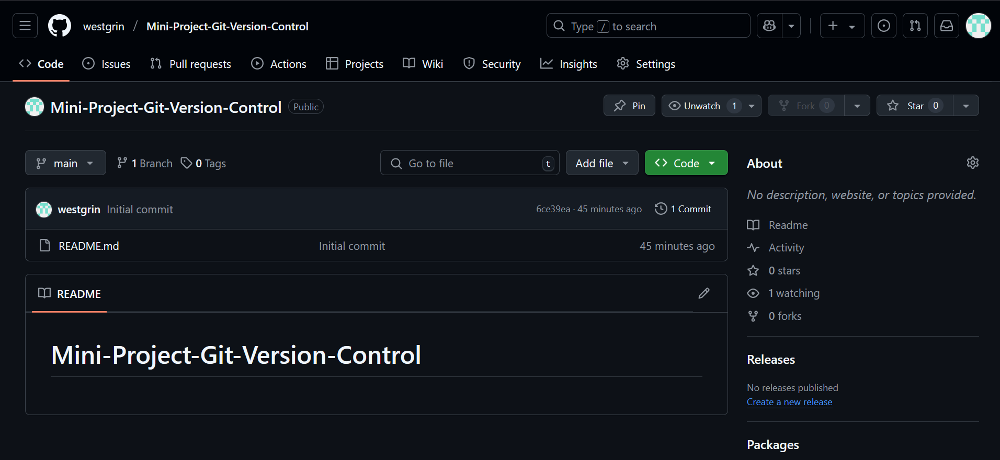
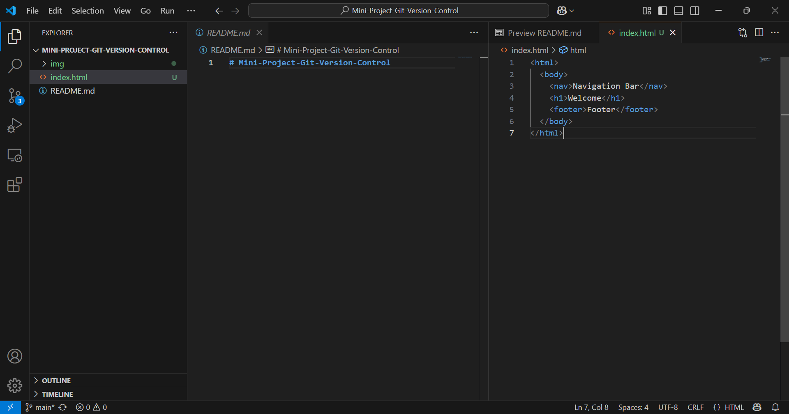
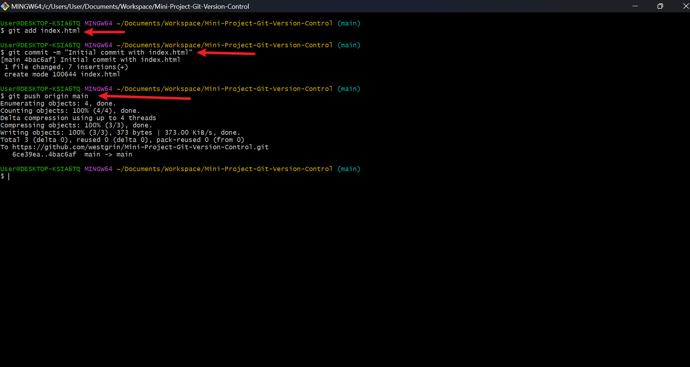
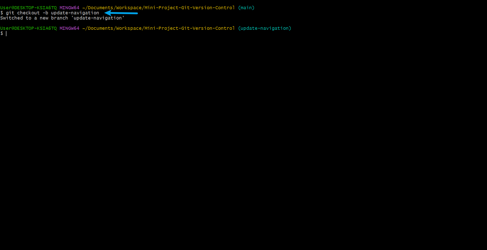
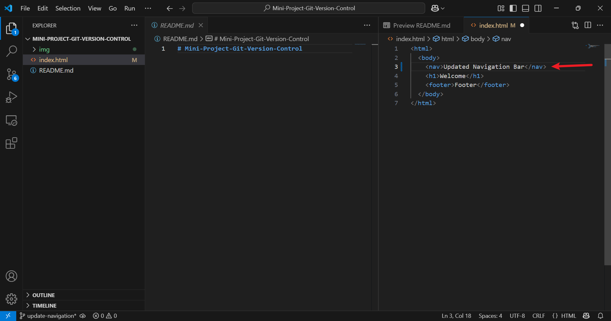
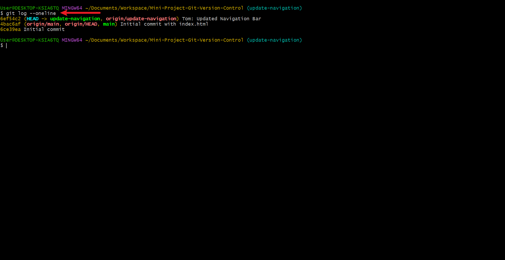
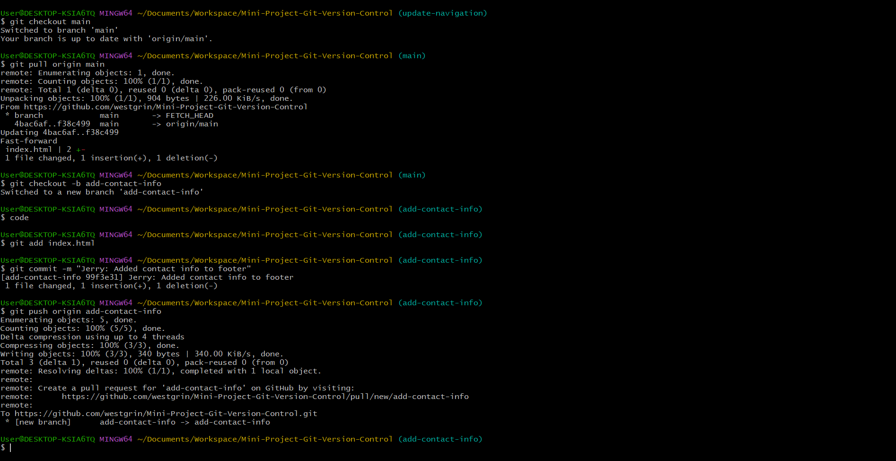
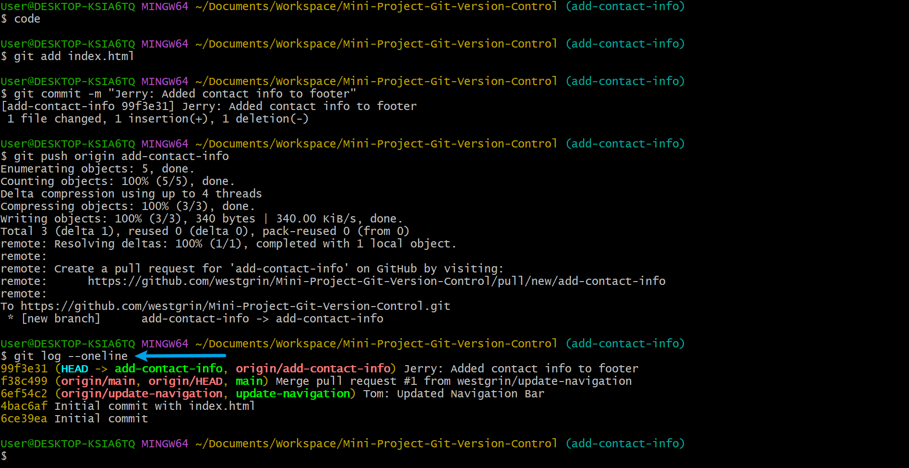

# Mini-Project-Git-Version-Control
# 3MTT Darey.io DevOps Mini Project - Git Version Control Basics

## Project Overview
This project simulates collaborative development using Git, following the Tom and Jerry example. It demonstrates how Git prevents overwriting issues through branching, commits, pull requests, and conflict resolution.

## Steps Taken

### 1. Initial Setup
- Created a GitHub repository: `Mini-Project-Git-Version-Control`.
- Cloned it using Git Bash: `git clone https://github.com/westgrin/Mini-Project-Git-Version-Control`.
- Created `index.html` with initial content using VS Code:
  ```html
  <html><body><nav>Navigation Bar</nav><h1>Welcome</h1><footer>Footer</footer></body></html>






- Committed and pushed to `main` using Git Bash: "Initial commit with index.html".



- Created branch: `update-navigation`



- Updated the navigation bar in `index.html` using VS Code:


- Committed: "Tom: Updated navigation bar" and pushed using Git Bash.


- Merged via a pull request on GitHub.



- Switched identity to Jerry: `git config user.name "Jerry"`.

- Created branch: `add-contact-info`.



- Added contact info to the footer using VS Code:

- Committed: "Jerry: Added contact info to footer" and pushed.

- Merged via a pull request.


- Jerry’s commit history:
Jerry's Commit



## Tools Used
- Git Bash: For Git operations (cloning, branching, committing, pushing).

- VS Code: For editing files and creating this documentation.

- GitHub: For hosting the repository and managing pull requests.

## Lessons Learned

- Branching prevents interference during collaboration.

- Pull requests ensure safe merging.

- Version control eliminates overwriting risks.

## Repository Link
[Github Repository](https://github.com/westgrin/Mini-Project-Git-Version-Control/blob/main/README.md)

## Conclusion

Git streamlined collaboration, ensuring no work was lost. This project highlighted the importance of version control in team projects.


